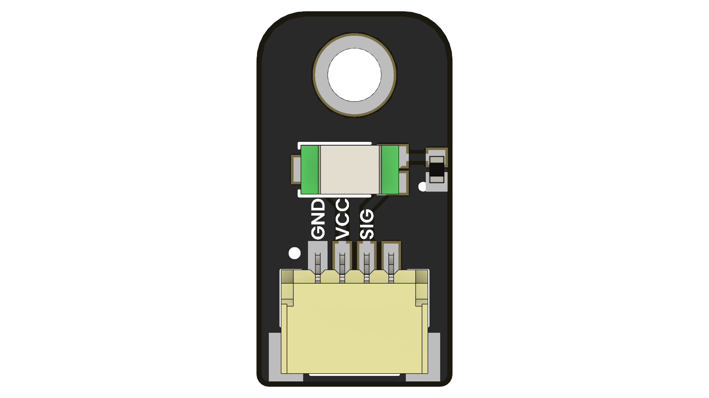

# TEMT600 Ambient Light Sensor

  

The **TEMT600 Ambient Light Sensor Development Board** is a compact module built around the Vishay TEMT600 phototransistor. It provides a linear analog voltage proportional to ambient light intensity, making it ideal for display back-light control, energy-saving systems, photographic exposure adjustment, and environmental monitoring.

## 📦 Overview

| Feature                 | Description                                                   |
|------------------------|---------------------------------------------------------------|
| Sensor Type            | Ambient Light Sensor (TEMT600)                                |

## 🧪 Use Cases

- Automatic display brightness adjustment  
- Photographic light metering  
- Smart home & IoT light sensing  
- Plant/garden lighting control  
- Wearable/light-level logging  
- Data-logging & environmental sensing

## 🚀 Getting Started

1. **Connect** the board via USB-C to your computer.
2. **Install** the appropriate board package for:
   - Arduino IDE
   - PlatformIO
   - ESP-IDF / Pico SDK
3. **Flash** a sample project or use one from `/firmware/`
4. **Power** via USB or external battery (if supported)

## 📚 Resources

- [Schematic Diagram](hardware/schematic.pdf)
- [Board Dimensions (DXF)](docs/dimensions.dxf)
- [Pinout Diagram](docs/pinout.png)
- [Firmware Examples](firmware/)
- [Getting Started Guide](docs/getting_started.md)

## 📝 License

All hardware and documentation in this project are licensed under the **MIT License**.  
Please refer to [`LICENSE.md`](LICENSE.md) for full terms.

  Template created by UNIT Electronics • Adapt this file to document your board!

