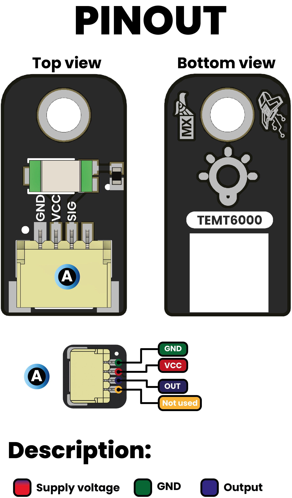
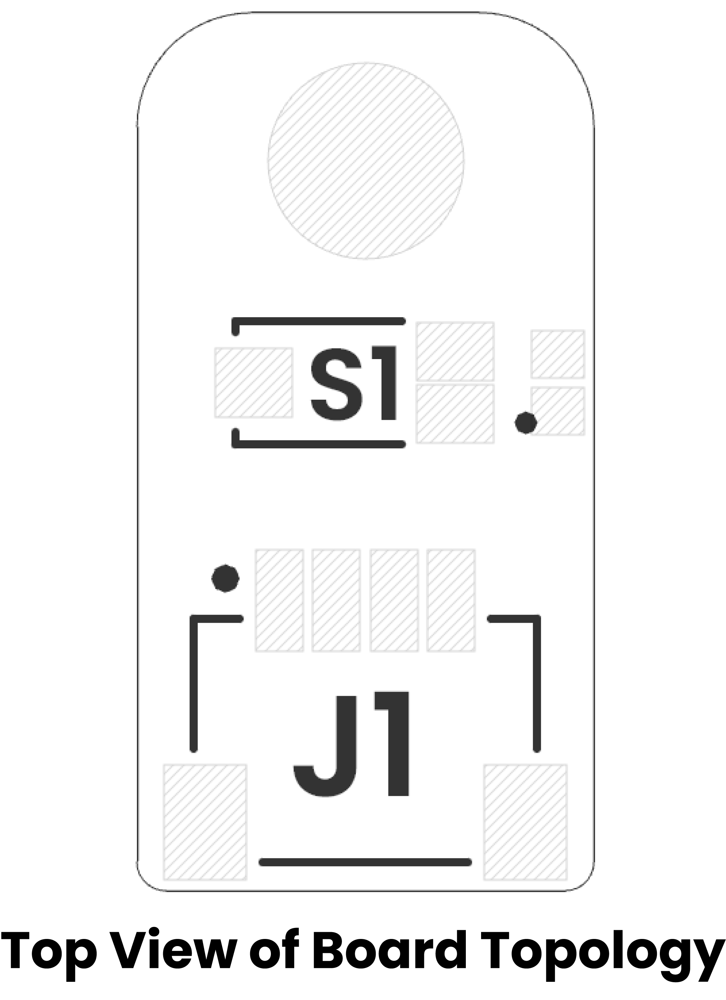

# Hardware

    <a href="./unit_sch_V_0_0_1_ue0098_TEMT6000.pdf">  Schematics</a>

---

## KEY TECHNICAL SPECIFICATIONS

<!-- 
========================================
EDITABLE SPECIFICATIONS TEMPLATE
========================================
Edita los valores a continuación según necesites.
El formato se mantendrá automáticamente en el PDF generado.
-->

### 🔌 CONNECTIVITY (Conectividad)
<!-- Edita las interfaces y conectores disponibles -->
| Interface | Details |
|-----------|---------|
| **Primary Interface** | GPIO (Analog) |
| **Connector Type** | JST 4-pin 1.0mm |
| **Logic Levels** | VCC |

## ⚙️ Technical Specifications

| Pin | Symbol | Type     | Description                                                                 |
| :---: | :----- | :------- | :-------------------------------------------------------------------------- |
| 1     | GND    | Power    | Ground reference (connect to MCU GND)                                       |
| 2     | VCC    | Power    | +3.3 V to +5 V supply voltage                                               |
| 3     | D0     | Analog   | voltage ∝ ambient light; connect to an ADC input of your MCU |

> **Note:** Do not exceed 5 V on VCC. SIO swings between 0 V (dark) and VCC (bright).

## 🔌 Pinout

    <a href="#"> Pinout</a>
      

### **Pinout Details**

| Pin Label | Function        | Notes                             |
|-----------|-----------------|-----------------------------------|
| VCC       | Power Supply    | 3.3V or 5V, depending on design    |
| GND       | Ground          | Common ground reference            |
| D0        | Data Signal     | Digital input/output signal        |

## 📏 Dimensions

<a href="./resources/unit_dimension_V_0_0_1_ue0098_TEMT6000.png">  Dimensions</a>

## 📃 Topology

<a href="./resources/unit_topology_V_0_0_1_ue0098_TEMT6000.png">  Topology</a>

| Ref. | Description                              |
|------|------------------------------------------|
| S1   | TEMT6000 Ambient Light Sensor            |
| J1   | JST 1 mm pitch Connector for Power Supply and Signal |

## Reference 

- [Datasheet](https://www.vishay.com/docs/84374/temt6000.pdf)