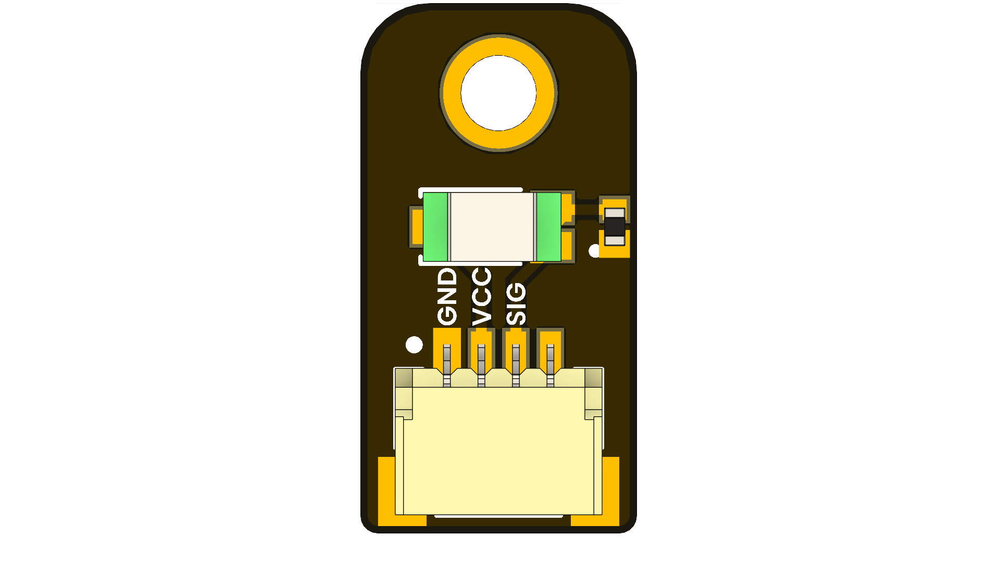

<!--
# README_TEMPLATE.md
This file serves as an input to generate a datasheet-style technical PDF.
Fill in each section without deleting or modifying the existing headings.
-->

# TEMT600 Ambient Light Sensor

 <!-- FILL HERE: replace image if needed -->

## Introduction

<!-- FILL HERE -->
The **TEMT600 Ambient Light Sensor Development Board** is a compact module built around the Vishay TEMT600 phototransistor. It provides a linear analog voltage proportional to ambient light intensity, making it ideal for display back-light control, energy-saving systems, photographic exposure adjustment, and environmental monitoring.

## Functional Description
 
- **Linear Analog Output:** VOUT varies linearly with illuminance  
- **High Sensitivity:** Detects from near-dark (≪1 lx) up to bright sunlight (>10 k lx)    

## Electrical Characteristics & Signal Overview

<!-- FILL HERE -->
- **Wide Supply Range:** 3.3 V – 5 V
- **Low Quiescent Current:** ≈ 0.5 mA typical 

## Applications

<!-- FILL HERE -->
- Automatic display brightness adjustment  
- Photographic light metering  
- Smart home & IoT light sensing  
- Plant/garden lighting control  
- Wearable/light-level logging  
- Data-logging & environmental sensing

## Features

<!-- FILL HERE -->
- **Compact Footprint:** 20 × 12 mm PCB with 3 mm mounting hole  
- **Standard JST-PH Connector:** 3-pin plug-and-play  
- **RoHS-Compliant & Lead-Free**

